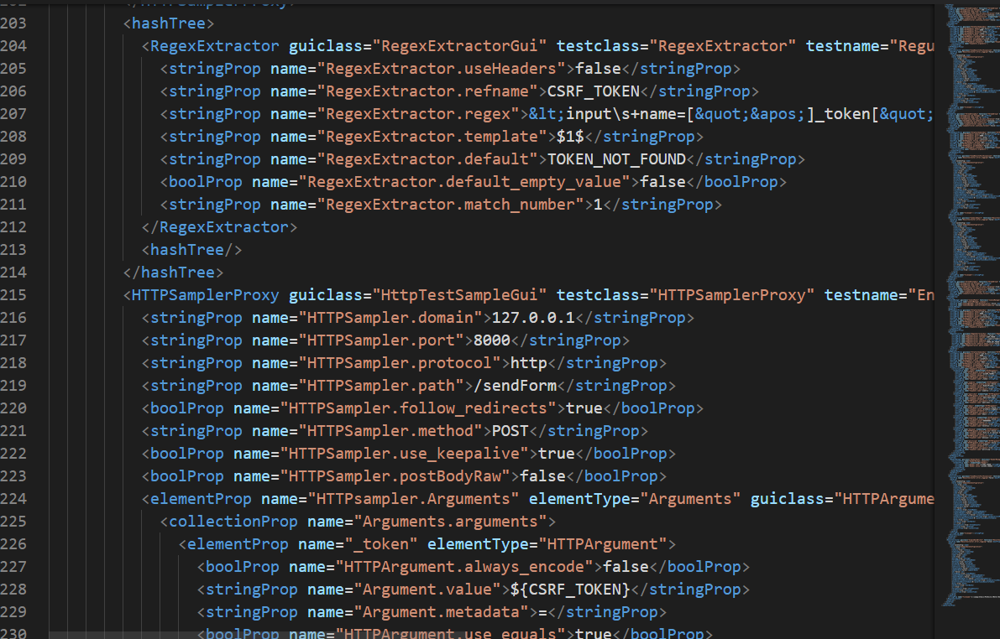

# 

  

---
## Integrantes del Proyecto
- **Vega Castañeda, Patrick Alexander**
- **Espinola Ravello, Annie Katerine**
- **Paredes Inga, Bryan Gerardo**

---
## Objetivo

El proyecto **PetUnity** tiene como objetivo brindar a los usuarios un espacio integral que permita:
- Publicar anuncios de mascotas perdidas para ayudar a encontrarlas rápidamente.
- Explorar recomendaciones de veterinarias confiables en su área.
- Acceder a información valiosa sobre el cuidado de diferentes animales, adaptada a cada etapa de su vida.

Este espacio está diseñado para fomentar el bienestar animal y facilitar la interacción entre los dueños de mascotas, veterinarias y la comunidad en general.

---

## Funcionalidades principales

### Ver anuncios de las mascotas perdidas
Los usuarios pueden explorar un listado de anuncios relacionados con mascotas perdidas. Para facilitar la búsqueda, se incluyen opciones de filtrado por:
- **Categorías**: los distritos donde se extraviaron las mascotas.
- **Nombre**: si conocen el nombre del animal.

De esta manera, se garantiza que las búsquedas sean rápidas y efectivas, ayudando a que las mascotas vuelvan a casa.

  

---

### Ver veterinarias recomendadas
PetUnity también ofrece un espacio para consultar veterinarias confiables y recomendadas por la comunidad. Los usuarios pueden buscar veterinarias:
- **Por distrito**: para encontrar las más cercanas a su ubicación.
- **Por nombre**: si buscan una veterinaria específica.

Esta funcionalidad permite a los usuarios acceder a servicios de calidad para el cuidado de sus mascotas, promoviendo su salud y bienestar.

  

---

### Ver cuidado de mascotas
Además de anuncios y recomendaciones, PetUnity pone a disposición información sobre el cuidado de diferentes tipos de mascotas. Los usuarios podrán consultar consejos adaptados a:
- Etapas de vida de los animales.
- Necesidades específicas según la especie.

Este espacio educativo busca empoderar a los dueños de mascotas con conocimientos prácticos que mejoren la calidad de vida de sus compañeros peludos.

  

---

# Pipeline con Jenkins

## Framework: Laravel
El pipeline está diseñado para trabajar con **Laravel**, un framework PHP que permite desarrollar aplicaciones web de manera ágil y organizada. La integración con Jenkins asegura que las etapas clave de desarrollo, pruebas y despliegue se ejecuten automáticamente, reduciendo errores humanos y acelerando el ciclo de vida del desarrollo.

---

### Construcción Automática
En esta etapa, el pipeline prepara el entorno de Laravel para su ejecución:
- **`composer install`**: Instala las dependencias necesarias declaradas en `composer.json`.
- **`php artisan migrate`**: Aplica las migraciones de la base de datos para asegurar que las tablas estén actualizadas.
- **`php artisan serve`**: Inicia un servidor de desarrollo para ejecutar la aplicación.

Esta etapa asegura que la aplicación esté lista para pruebas o despliegues.

#### Evidencia:

  
  

---

### Análisis estático de código
Se utiliza **SonarQube** para analizar la calidad del código fuente y detectar posibles errores, vulnerabilidades o malos patrones de diseño. Esto asegura que el código sea mantenible y seguro antes de continuar con otras etapas.

#### Evidencia:

  
  
  

---

### Pruebas Unitarias
Se utiliza **PHPUnit**, integrado en Laravel, para garantizar que las funcionalidades individuales del proyecto (métodos, clases) se comporten correctamente.

#### Evidencia:

  
  
  

---

### Pruebas Funcionales (Postman y Newman)
Las pruebas funcionales se desarrollaron inicialmente en **Postman**, donde se configuraron los endpoints a probar y se exportaron en formato JSON. Posteriormente, se usó **Newman** (CLI de Postman) en Jenkins para automatizar su ejecución.

#### Evidencia:

  
  
  

---

### Pruebas de Performance
**Apache JMeter** se usó para medir el rendimiento de la aplicación bajo diferentes niveles de carga. Se configuraron pruebas para simular múltiples usuarios accediendo a la plataforma simultáneamente.

#### Evidencia:

  
  
  

---

### Pruebas de Seguridad
Para identificar vulnerabilidades en la aplicación, se utilizó **OWASP ZAP**, una herramienta robusta para análisis de seguridad automatizado.

#### Evidencia:

  
  

---

## Resumen del Proyecto

Para garantizar una ejecución eficiente del pipeline y un flujo de trabajo claro, utilizamos un tablero de **GitHub Projects** para gestionar las tareas relacionadas con la verificación y validación del proyecto. Este tablero nos permitió:

- **Planificar**: Dividir las etapas del pipeline en tareas específicas y ordenarlas en función de su prioridad.
- **Rastrear el progreso**: Visualizar en qué etapa se encontraba cada tarea, desde la planificación hasta su finalización.
- **Colaborar**: Asegurar que cada miembro del equipo estuviera alineado con el estado actual del proyecto y las actividades restantes.
- **Documentar**: Proveer evidencia de un enfoque organizado para el desarrollo y la automatización del pipeline.

### Tablero de GitHub Projects
El tablero está dividido en tres columnas principales:
1. **Todo**: Tareas pendientes.
2. **In Progress**: Tareas en progreso.
3. **Done**: Tareas completadas.

  

Este enfoque permitió implementar un pipeline sólido en Jenkins que incluye construcción automática, análisis estático, pruebas unitarias, funcionales, de rendimiento y de seguridad, asegurando que todos los aspectos clave del proyecto fueran cubiertos de manera estructurada.

