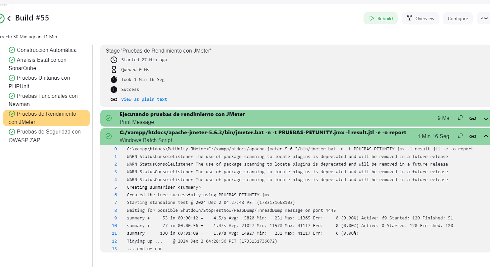

# <div style="text-align: center;">
  
</div>

---
## 👥 Integrantes del Proyecto
- **Vega Castañeda, Patrick Alexander**
- **Espinola Ravello, Annie Katerine**
- **Paredes Inga, Bryan Gerardo**

---

## 📚 Índice
- [Objetivo](#objetivo)
- [Funcionalidades principales](#funcionalidades-principales)
  - [Ver anuncios de las mascotas perdidas](#ver-anuncios-de-las-mascotas-perdidas)
  - [Ver veterinarias recomendadas](#ver-veterinarias-recomendadas)
  - [Ver cuidado de mascotas](#ver-cuidado-de-mascotas)
-🔄 [Pipeline con Jenkins](#pipeline-con-jenkins)
  -🚀 [Construcción Automática](#construcción-automática)
  -🔍 [Análisis estático de código](#análisis-estático-de-código)
  -🧪 [Pruebas Unitarias](#pruebas-unitarias)
  -🛠️ [Pruebas Funcionales (Postman y Newman)](#pruebas-funcionales-postman-y-newman)
  -⚡ [Pruebas de Performance](#pruebas-de-performance)
  -🔒 [Pruebas de Seguridad](#pruebas-de-seguridad)

---
## Objetivo

El proyecto **PetUnity** tiene como objetivo brindar a los usuarios un espacio integral que permita:
- Publicar anuncios de mascotas perdidas para ayudar a encontrarlas rápidamente.
- Explorar recomendaciones de veterinarias confiables en su área.
- Acceder a información valiosa sobre el cuidado de diferentes animales, adaptada a cada etapa de su vida.

Este espacio está diseñado para fomentar el bienestar animal y facilitar la interacción entre los dueños de mascotas, veterinarias y la comunidad en general.

---

## Funcionalidades principales

### Ver anuncios de las mascotas perdidas
Los usuarios pueden explorar un listado de anuncios relacionados con mascotas perdidas. Para facilitar la búsqueda, se incluyen opciones de filtrado por:
- **Categorías**: los distritos donde se extraviaron las mascotas.
- **Nombre**: si conocen el nombre del animal.

De esta manera, se garantiza que las búsquedas sean rápidas y efectivas, ayudando a que las mascotas vuelvan a casa.

<div style="text-align: center;">
  
</div>

---

### Ver veterinarias recomendadas
PetUnity también ofrece un espacio para consultar veterinarias confiables y recomendadas por la comunidad. Los usuarios pueden buscar veterinarias:
- **Por distrito**: para encontrar las más cercanas a su ubicación.
- **Por nombre**: si buscan una veterinaria específica.

Esta funcionalidad permite a los usuarios acceder a servicios de calidad para el cuidado de sus mascotas, promoviendo su salud y bienestar.

<div style="text-align: center;">
  
</div>

---

### Ver cuidado de mascotas
Además de anuncios y recomendaciones, PetUnity pone a disposición información sobre el cuidado de diferentes tipos de mascotas. Los usuarios podrán consultar consejos adaptados a:
- Etapas de vida de los animales.
- Necesidades específicas según la especie.

Este espacio educativo busca empoderar a los dueños de mascotas con conocimientos prácticos que mejoren la calidad de vida de sus compañeros peludos.

<div style="text-align: center;">
  
</div>

---

# Pipeline con Jenkins

## Framework: Laravel
El pipeline está diseñado para trabajar con **Laravel**, un framework PHP que permite desarrollar aplicaciones web de manera ágil y organizada. La integración con Jenkins asegura que las etapas clave de desarrollo, pruebas y despliegue se ejecuten automáticamente, reduciendo errores humanos y acelerando el ciclo de vida del desarrollo.

---

### Construcción Automática
En esta etapa, el pipeline prepara el entorno de Laravel para su ejecución:
- **`composer install`**: Instala las dependencias necesarias declaradas en `composer.json`.
- **`php artisan migrate`**: Aplica las migraciones de la base de datos para asegurar que las tablas estén actualizadas.
- **`php artisan serve`**: Inicia un servidor de desarrollo para ejecutar la aplicación.

Esta etapa asegura que la aplicación esté lista para pruebas o despliegues.

#### Evidencia:
<div style="text-align: center;">
  
  
</div>

---

### Análisis estático de código
Se utiliza **SonarQube** para analizar la calidad del código fuente y detectar posibles errores, vulnerabilidades o malos patrones de diseño. Esto asegura que el código sea mantenible y seguro antes de continuar con otras etapas.

#### Evidencia:
<div style="text-align: center;">
  
  
  
</div>

---

### Pruebas Unitarias
Se utiliza **PHPUnit**, integrado en Laravel, para garantizar que las funcionalidades individuales del proyecto (métodos, clases) se comporten correctamente.

#### Evidencia:
<div style="text-align: center;">
  
  
  
</div>

---

### Pruebas Funcionales (Postman y Newman)
Las pruebas funcionales se desarrollaron inicialmente en **Postman**, donde se configuraron los endpoints a probar y se exportaron en formato JSON. Posteriormente, se usó **Newman** (CLI de Postman) en Jenkins para automatizar su ejecución.

#### Evidencia:
<div style="text-align: center;">
  
  
  
</div>

---

### Pruebas de Performance
**Apache JMeter** se usó para medir el rendimiento de la aplicación bajo diferentes niveles de carga. Se configuraron pruebas para simular múltiples usuarios accediendo a la plataforma simultáneamente.

#### Evidencia:
<div style="text-align: center;">
  
  
  
</div>

---

### Pruebas de Seguridad
Para identificar vulnerabilidades en la aplicación, se utilizó **OWASP ZAP**, una herramienta robusta para análisis de seguridad automatizado.

#### Evidencia:
<div style="text-align: center;">
  
  
</div>

---

#### Código completo del Jenkins (dentro de Jenkinsfile):
```groovy
pipeline {
    agent any
    environment {
        PROJECT_DIR = 'C:/xampp/htdocs/PetUnity-Verificacion'
        //----------------------------------------------
        SONARQUBE_START = 'C:/xampp/htdocs/sonarqube-10.7.0.96327/bin/windows-x86-64/StartSonar.bat'
        SONAR_SCANNER_PATH = 'C:/xampp/htdocs/sonar-scanner-6.2.1.4610-windows-x64/bin/sonar-scanner.bat' 
        //----------------------------------------------
        POSTMAN_COLLECTION = 'C:/xampp/htdocs/PetUnity-Verificacion/Verificaion-Validacion.postman_collection.json'
        NEWMAN_PATH = 'C:/Users/patri/AppData/Roaming/npm/newman.cmd'
        //----------------------------------------------
        JMETER_PATH = 'C:/xampp/htdocs/apache-jmeter-5.6.3/bin/jmeter.bat'
        JMETER_TEST_DIR = 'C:/xampp/htdocs/PetUnity-JMeter'
        JMETER_TEST_FILE = 'PRUEBAS-PETUNITY.jmx'
        //----------------------------------------------
        ZAP_DIR = 'C:/Program Files/ZAP/Zed Attack Proxy'
        EXCLUSION_FILE = 'C:/xampp/htdocs/PetUnity-Verificacion/exclusion.txt'
        TARGET_URL = 'http://127.0.0.1:8000'
        ZAP_REPORT_PATH = 'C:/xampp/htdocs/PetUnity-Verificacion/zap-report.html'
        ZAP_PORT = '8083'
    }
    stages {
        stage('Construcción Automática') {
            steps {
                echo 'Ejecutando: composer install, php artisan migrate, php artisan serve'
                dir(PROJECT_DIR) {
                    bat 'composer install'
                    bat 'php artisan migrate'
                    bat 'start /B php artisan serve' 
                }
            }
        }
        stage('Análisis Estático con SonarQube') {
            steps {
                echo 'Iniciando SonarQube'
                bat "start $SONARQUBE_START"
                echo 'Esperando a que SonarQube se inicie...'
                sleep(time: 30, unit: 'SECONDS') 
                echo 'Ejecutando análisis estático con SonarQube'
                dir(PROJECT_DIR) {
                    withSonarQubeEnv('Sonar-PetUnity') { 
                       bat "$SONAR_SCANNER_PATH"
                    }
                }
            }
        }
        stage('Pruebas Unitarias con PHPUnit') {
            steps {
                echo 'Ejecutando pruebas unitarias con PHPUnit'
                dir(PROJECT_DIR) {
                    bat 'vendor\\bin\\phpunit --configuration phpunit.xml'
                }
            }
        }
        stage('Pruebas Funcionales con Newman') {
            steps {
                echo 'Ejecutando pruebas funcionales con Newman'
                bat "$NEWMAN_PATH run $POSTMAN_COLLECTION"
            }
        }
        stage('Pruebas de Rendimiento con JMeter') {
            steps {
                echo 'Ejecutando pruebas de rendimiento con JMeter'
                dir(JMETER_TEST_DIR) {
                    bat "$JMETER_PATH -n -t $JMETER_TEST_FILE -l result.jtl -e -o report"
                }
            }
        }
        stage('Pruebas de Seguridad con OWASP ZAP') {
            steps {
                echo 'Iniciando OWASP ZAP en modo daemon'
                script {
                    dir(ZAP_DIR) {
                        bat """
                            start /B zap.bat -daemon -port $ZAP_PORT \
                            -config api.disablekey=true \
                            -config spider.excludedregexfile=$EXCLUSION_FILE
                        """
                    }
                    echo 'Esperando que OWASP ZAP esté disponible...'
                    sleep(time: 30, unit: 'SECONDS')

                    
                    echo 'Iniciando Spider Scan'
                    bat """
                        curl -X GET "http://127.0.0.1:$ZAP_PORT/JSON/spider/action/scan/?url=$TARGET_URL&maxChildren=10" \
                        -H "Content-Type: application/json"
                    """
                    echo 'Esperando a que Spider Scan complete su ejecución...'
                    sleep(time: 2, unit: 'MINUTES')

                    
                    echo 'Iniciando Active Scan'
                    bat """
                        curl -X GET "http://127.0.0.1:$ZAP_PORT/JSON/ascan/action/scan/?url=$TARGET_URL" \
                        -H "Content-Type: application/json"
                    """
                    echo 'Esperando a que Active Scan complete su ejecución...'
                    sleep(time: 5, unit: 'MINUTES')
                    //Para ver el avance
                    //http://127.0.0.1:8083/JSON/spider/view/status/?scanId=1
                    echo 'Generando reporte de OWASP ZAP'
                    bat """
                        curl -X GET "http://127.0.0.1:$ZAP_PORT/OTHER/core/other/htmlreport/?" \
                        --output $ZAP_REPORT_PATH
                    """
                    echo 'Reporte generado en: $ZAP_REPORT_PATH'
                }
            }
        }
    }
}
```````
---

## Resumen del Proyecto

Para garantizar una ejecución eficiente del pipeline y un flujo de trabajo claro, utilizamos un tablero de **GitHub Projects** para gestionar las tareas relacionadas con la verificación y validación del proyecto. Este tablero nos permitió:

- **Planificar**: Dividir las etapas del pipeline en tareas específicas y ordenarlas en función de su prioridad.
- **Rastrear el progreso**: Visualizar en qué etapa se encontraba cada tarea, desde la planificación hasta su finalización.
- **Colaborar**: Asegurar que cada miembro del equipo estuviera alineado con el estado actual del proyecto y las actividades restantes.
- **Documentar**: Proveer evidencia de un enfoque organizado para el desarrollo y la automatización del pipeline.

### Tablero de GitHub Projects
El tablero está dividido en tres columnas principales:
1. **Todo**: Tareas pendientes.
2. **In Progress**: Tareas en progreso.
3. **Done**: Tareas completadas.

<div style="text-align: center;">
  
</div>

Este enfoque permitió implementar un pipeline sólido en Jenkins que incluye construcción automática, análisis estático, pruebas unitarias, funcionales, de rendimiento y de seguridad, asegurando que todos los aspectos clave del proyecto fueran cubiertos de manera estructurada.


